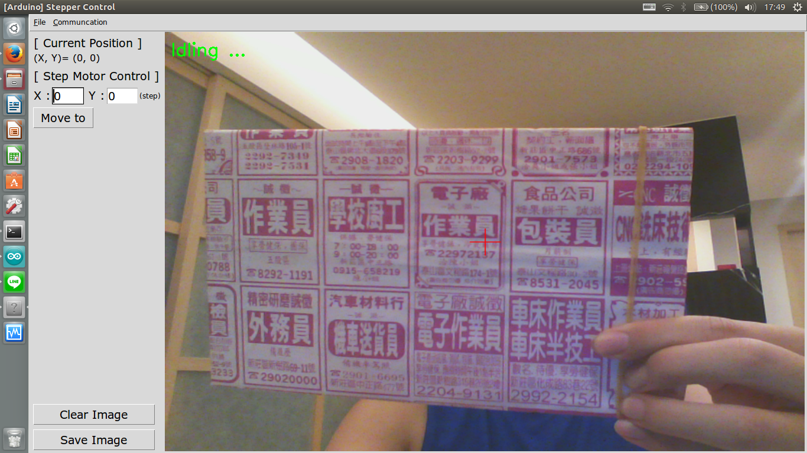

### StepperControl
The python code with GUI to to display current position (in step unit) and move the motor to specific loaction
```command line: 
python gui_main.py
```

### Arduino Code
Please follow the instruction in: 
    https://github.com/FarmBot/farmbot-arduino-firmware 

### Python lib
Tkinter
opencv


