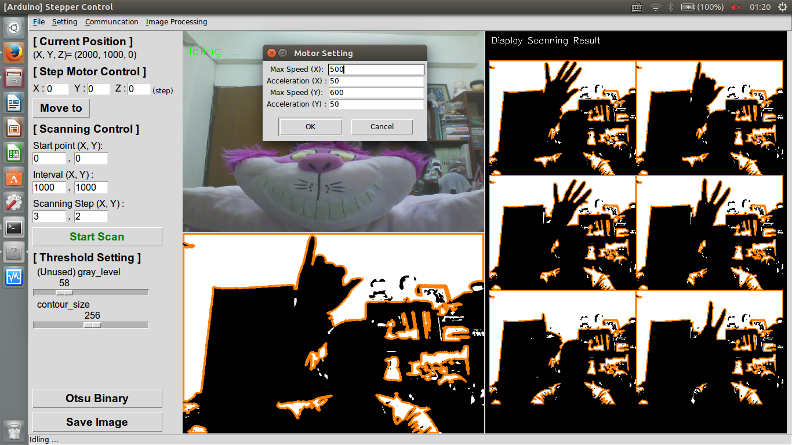

StepperControl
==========================
The Python code with a user interface is porvided with following functions:
1. 3-axis stepper-motor control
2. auto scanning function by setting start point, scanning interval and scanning amount
3. real-time image display 
4. image processing function(otsu method is provided here)
5. basic setting function(Max Speed & Acceleration)



> The communication between Arduino and computer is automatically built when the program is opened. If the connection is failed, it can be re-built again by clicking the 'Connect to Arduino' button in menubar
> The communication between Camera and computer is automatically built when the program is opened. If the connection is failed, it can be re-built again by clicking the 'Connect to Camera' button in menubar
> The parameters on UI are saved automatically after the program is closed. 

```command line: 
python gui_main.py
```

### Arduino Code
Reference by Farmbot:
    https://github.com/FarmBot/farmbot-arduino-firmware 

Parameters for commands
-----------------------
Parameters|Description            |Unit of Measurement
----------|-----------------------|-------------------
X         |X movement             |steps
Y         |Y movement             |steps
Z         |Z movement	          |steps

Arduino parameter numbers
------------------------
ID   | Name
-----|----------------------------
41   | MOVEMENT_STEPS_ACC_DEC_X
42   | MOVEMENT_STEPS_ACC_DEC_Y
43   | MOVEMENT_STEPS_ACC_DEC_Z
71   | MOVEMENT_MAX_SPD_X
72   | MOVEMENT_MAX_SPD_Y
73   | MOVEMENT_MAX_SPD_Z

Codes sent to the arduino
------------------------
Moving 100, 200, 300 steps on X & Y & Z direction respectively
```
G00 X100 Y200 Z300
```
Read the Parameter Value of X acceleration
```
F21 P41
```
Change the Parameter Value of Y acceleration to 300
```
F22 P41 V300
```

P.S. The oservation speed could be changed by setting MOVEMENT_MAX_SPD or MOVEMENT_STEPS_ACC_DEC

### Command line for install Arudino and its related lib
```
sudo apt-get install arduino gcc-avr avr-libc avrdude python-configobj python-jinja2 python-serial
mkdir tmp
cd tmp
git clone https://github.com/miracle2k/python-glob2
cd python-glob2
wget https://bootstrap.pypa.io/ez_setup.py -O - | sudo python
sudo python setup.py install
git clone git://github.com/amperka/ino.git
cd ino
sudo make install
cd ~/tmp/
git clone  https://github.com/FarmBot/farmbot-arduino-firmware
cd farmbot-arduino-firmware
ino build
ino upload
```

### Python lib
Tkinter  
opencv  
python-serial  


